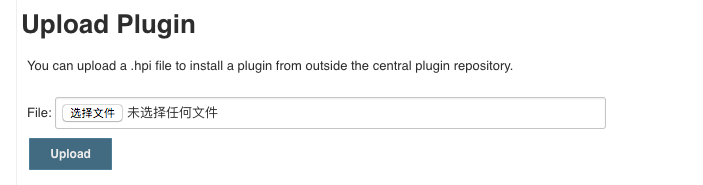
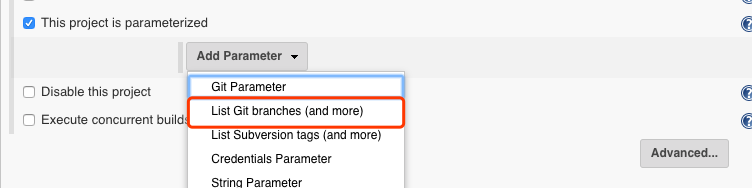
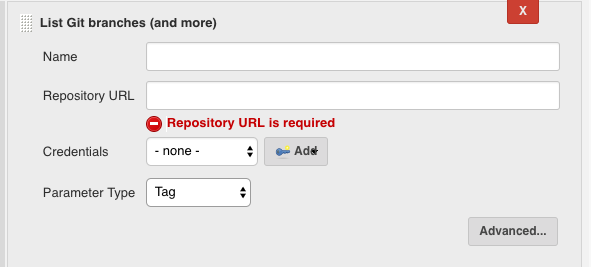
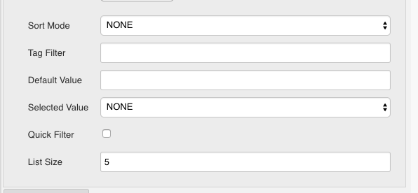

This plugin is highly motivated by [Git Parameter Plugin](https://wiki.jenkins.io/display/JENKINS/Git+Parameter+Plugin) but But unlike [Git Parameter Plugin](https://wiki.jenkins.io/display/JENKINS/Git+Parameter+Plugin), this plugin will not change working space at all at build-time


## Background

When using jenkins pipeline style job and defining pipeline through "Pipeline script" (not "Pipeline script from SCM"), it becomes difficult to use [Git Parameter Plugin](https://wiki.jenkins.io/display/JENKINS/Git+Parameter+Plugin) since the plugin uses SCM in the job definition.

Sometimes we want to specify a git branch or tag before as a parameter, for "Pipeline script" jobs that use SCM in the script, it is impossible with [Git Parameter Plugin](https://wiki.jenkins.io/display/JENKINS/Git+Parameter+Plugin). In this particular case, a plugin that can list remote git branches or tags without defining scm in the job is needed.

## Features

The plugin is able to:

1. fetching remote git branches or tags giving repository url and credentials
2. specifying the branch or tag users want
3. exposing the name/value as an environment variable for further use.
4. having advance options the same as [Git Parameter Plugin](https://wiki.jenkins.io/display/JENKINS/Git+Parameter+Plugin)

## design
The plugin adds an option to "Add Parameter".

Required fields:

1. name
2. Repository URL
3. Credentials
4. Parameter Type: branch/tag/branch_or_tag/revision/pull_request

Optional fields(same as [Git Parameter Plugin](https://wiki.jenkins.io/display/JENKINS/Git+Parameter+Plugin)):

1. Branch Filter
2. Tag Filter
3. Sort Mode
4. Default Value
5. Selected Value: None/top/default
6. Quick Filter
7. List Size

## How to use

Currently we have to build and upload it to Jenkins manually

### build

The code use JDK7 and jenkins 2.26

Checkout the code and run command

```
mvn clean package
```

### upload

Open jenkins console and go to pluginManger -> Advanced

Choose file and upload



### add parameter


### fill required fields


### fill advanced fields(optional)
