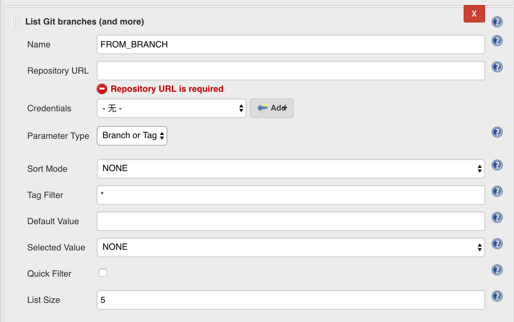
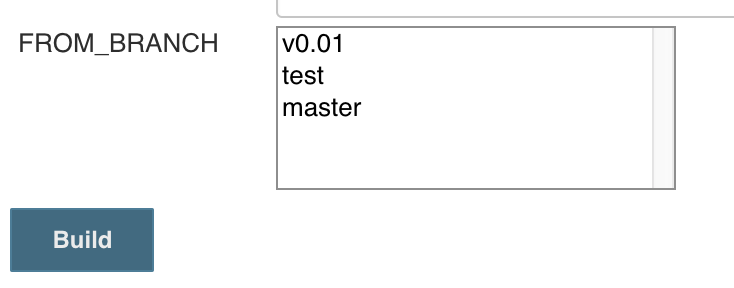

This plugin adds ability to choose branches, tags or revisions from Git
repository configured as a parameter in your builds.

Unlike [Git Parameter Plugin](https://wiki.jenkins.io/display/JENKINS/Git+Parameter+Plugin),
this plugin requires a Git repository defined instead of reading Git SCM
configuration from your projects.

Unlike [Git Parameter Plugin](https://wiki.jenkins.io/display/JENKINS/Git+Parameter+Plugin),
this plugin will not change working space at all at build-time.

## Background

When using jenkins pipeline style job and defining pipeline through "Pipeline script" (not "Pipeline script from SCM"), it becomes difficult to use [Git Parameter Plugin](https://wiki.jenkins.io/display/JENKINS/Git+Parameter+Plugin) since the plugin uses SCM in the job definition.

Sometimes we want to specify a git branch or tag before as a parameter, for "Pipeline script" jobs that use SCM in the script, it is impossible with [Git Parameter Plugin](https://wiki.jenkins.io/display/JENKINS/Git+Parameter+Plugin). In this particular case, a plugin that can list remote git branches or tags without defining scm in the job is needed.

## Quick usage guide

-   Install the plugin
-   Go to your project, click **This project is parameterized,** click
    **Add Parameter,** choose **List Git Branches (and more)**
    Brief description of the named fields:
    -   **Name**- Name for the parameter, e.g. `FROM_BRANCH`
    -   **Repository URL**- git repository URL, e.g.
        `ssh://<git@github.com>:jenkinsci/list-git-branches-parameter-plugin.git`
    -   **Credentials**- Git credentials stored in jenkins
-   Start a build and use the parameter
    
